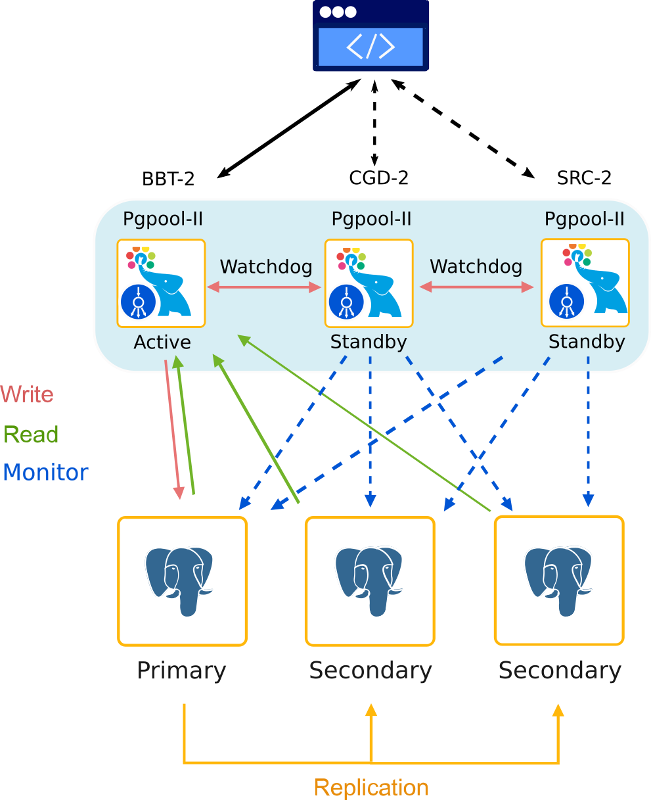
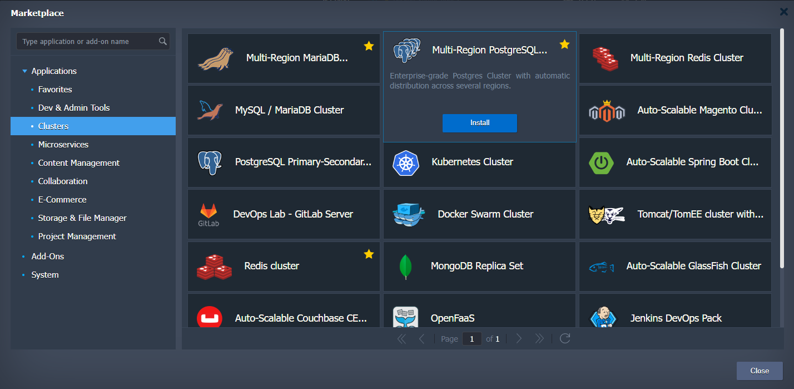
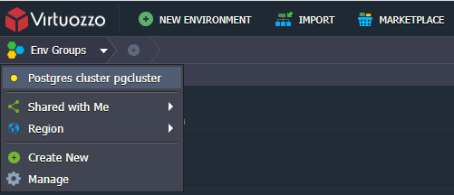
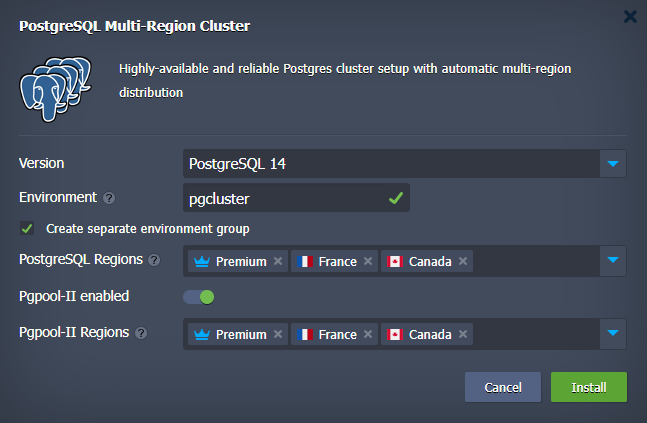
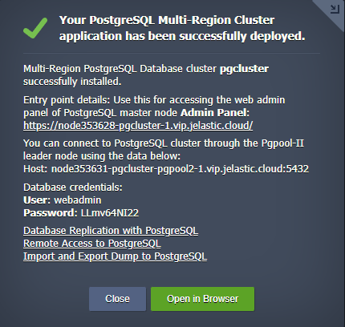
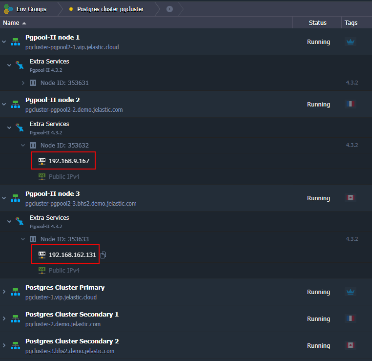

 

## PostgreSQL Auto-Сlustering Across Different Regions with Embedded Load Balancing, Automatic Failover and Disaster Recovery

PostgreSQL Multi-Region cluster solution is packaged as an advanced highly available cluster on top of managed Virtuozzo Application Platform dockerized stack templates. 

### Database topology
PostgreSQL officially supports the Primary-Secondary topology only. So, for the required Cross-Region deployment this topology is used and one more secondary node for Disaster Recovery is added. Thus, the final topology looks like: Primary-Secondary-Secondary.

 

The package includes Highly Available [*Pgpool-II Load Balancer*](https://www.pgpool.net/mediawiki/index.php/Main_Page) layer to distribute requests and manage PostgreSQL replication topology.

### High Availability and Failover

Main purpose of Cross-Region DB clusters is high availability and failover capabilities at the data centre level - database should be accessible even if one of regions becomes unavailable. 
Upon Cross-Region cluster, customer is able to select multiple Regions and select "Primary" Region that should host primary servers and “Secondary” Region that should host secondary servers.

### Installation Process

Go to [VAP Marketplace](https://www.virtuozzo.com/application-platform-docs/marketplace/), find **Multi-Region PostgreSQL Cluster** application and run it. 

Since PaaS allows to place one environment per one Region only, the Multi-Region installation stipulates creating Multi-Environment topology. In order to distinguish one Multi-Region installation from another we create [Environment Group](https://www.virtuozzo.com/application-platform-docs/environment-groups/) with name that user provides during installation and put all the newly created environments into this group. So, in the opened installation window specify the **Environment** name which can be used for Multi-Region environments isolation if you pick the **Create separate environment group** option. For example, if you use **pgcluster** for the **Environment** field, all the cluster parts will be put into the **Postgres cluster pgcluster** environment group.

If required you may exclude load balancing layer from the cluster topology before installation with **Pgpool-II enabled** toggle. Keep in mind that you won’t be able to do that later and vice versa if you disable it before installation you will not be able to add the load balancing layer afterward.
So, this option adds load-balancing, monitoring and management node Pgpool-II in front of Database node in each Region. It is recommended to have three nodes in order to maintain a quorum for Database Primary member election. Pgpool nodes can serve as the entry points to the cluster.
Then, select the preferable [regions](https://docs.jelastic.com/environment-regions) for database nodes in the **PostgreSQL Regions** field and for load balancer nodes in the **Pgpool-II Regions**. 
Use tooltips to realize which region fits better for the Primary role and which ones for Secondaries. The order of region selection matters. 
Finally, click on **Install**.

After successful installation, you’ll receive an email based on your environment topology with access credentials like in the successfull installation window.

### Entry Point

By default, as an entry point we propose to use a leader Pgpool-II node deployed into first selected Region. If it fails you can use any of Pgpool-II nodes available taking either [hostname](https://www.virtuozzo.com/application-platform-docs/container-dns-hostnames/#hostnames-for-specific-containers) or IP address.

In case your client software supports multiple entry points you can setup all of them in a connection string to ensure automatic failover.